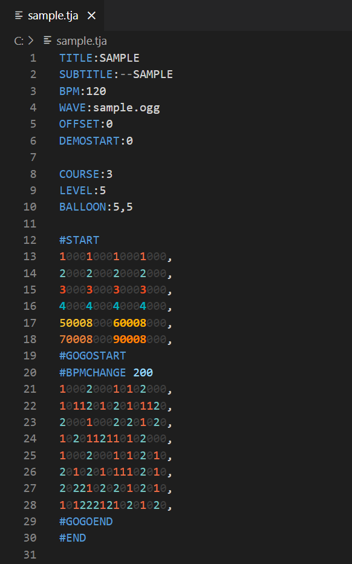
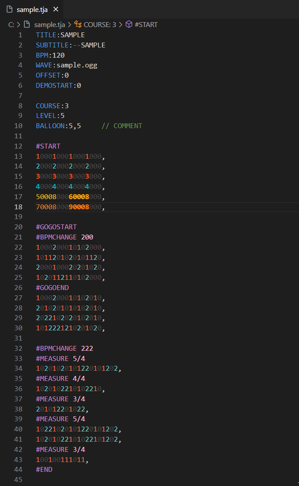
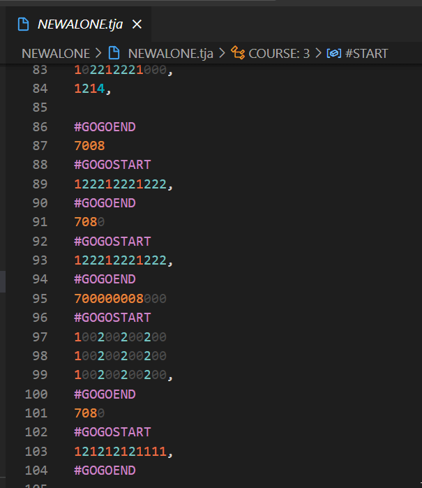

# TJA Format Support

太鼓の達人シミュレーターで使用される`.tja`フォーマットをサポートします。
`.tjc` `.tjf` `.tmg`にもある程度対応しています。

主な機能
- 譜面の色付け
- 譜面分岐の色付け
- 簡易的な入力補完
- 直前の行と同じ長さの0埋め機能（入力補完）
- ヘッダ･命令にマウスを重ねた際に解説を表示
- 譜面編集の便利機能（範囲選択 → 右クリック）
- コードの折りたたみ（譜面・段位道場課題曲・譜面分岐）
- 譜面情報の表示（左部サイドバー → エクスプローラー → 譜面情報）
- 大まかなシンボル表示（左部サイドバー → エクスプローラー → アウトライン）
- パンくずリストの表示（上部）
- コンボ数の表示（下部ステータスバー）
- 小節数の表示（下部ステータスバー）
- 小節の移動機能（下部ステータスバー小節数クリック）
- 風船音符の打数表示（風船音符にマウスを重ねる）
- 風船音符の打数･譜面場所へのジャンプ（カーソルを合わせてF12 または 右クリック→定義へ移動）

