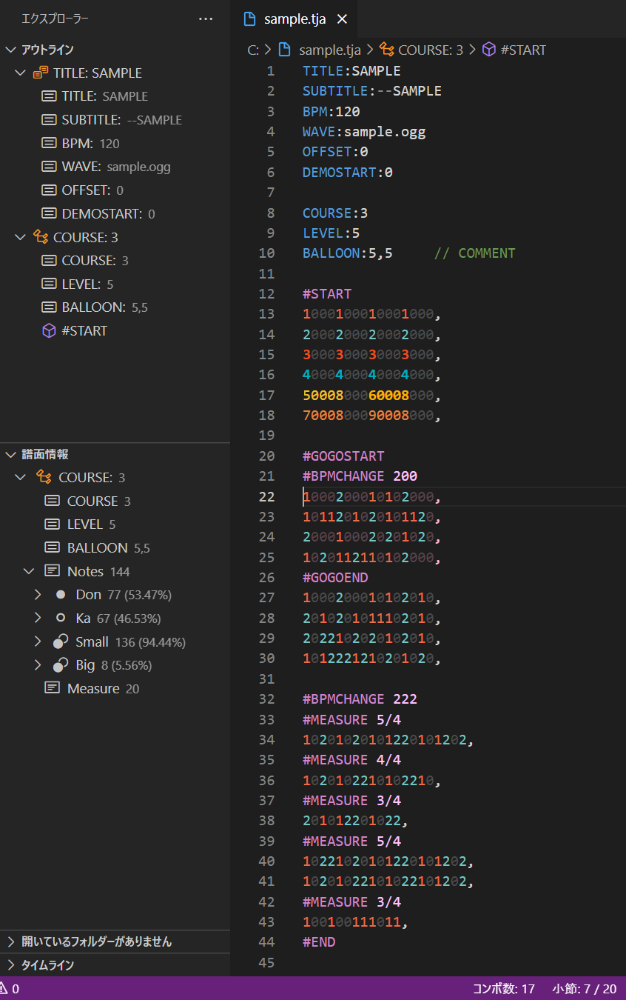

# TJA Format Support

支持太鼓之达人模拟器中使用的 `.tja` 格式。
也在一定程度上支持 `.tjc`、`.tjf`、`.tmg` 格式。

[日本語](../README.md) | [English](README.en.md) | **中文**

## 主要功能

### 视觉增强
- 谱面语法高亮
- GoGo Time 高亮显示
- 小节号自动显示

### 编辑功能
- 头部信息和命令自动补全
- 与上一行相同长度的0填充
- 气球音符打数编辑（将光标放在气球音符上按F2）
- 跳转到气球音符打数/谱面位置（光标在音符上按F12或右键→转到定义）
- 气球音符打数显示（鼠标悬停在气球音符上）
- 头部信息、命令和参数的工具提示文档
- 便捷的谱面编辑命令（选择范围→右键）
  - 谱面缩放
  - 谱面裁剪
  - 滚动速度固定化
  - 批量删除命令
  - 等等

### 其他实用功能
- 代码折叠（谱面、段位道场乐曲、分支谱面）
- 粗略符号显示（左侧边栏→资源管理器→大纲）
- 谱面信息显示（左侧边栏→资源管理器→谱面信息）
- 面包屑导航显示（顶部栏）
- 连击数显示（底部状态栏）
- 小节数显示（底部状态栏）
- 小节导航（点击状态栏中的小节数）

## 截图

